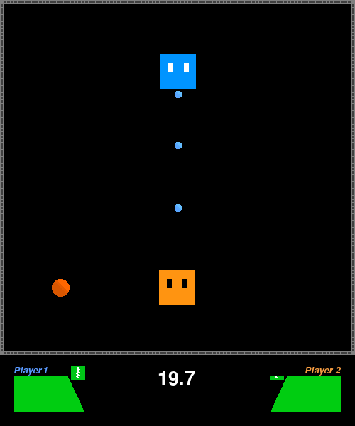
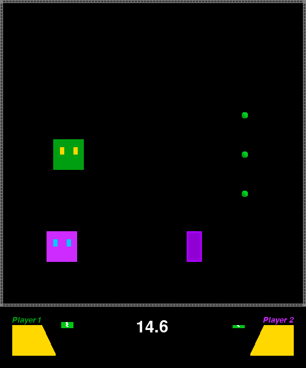
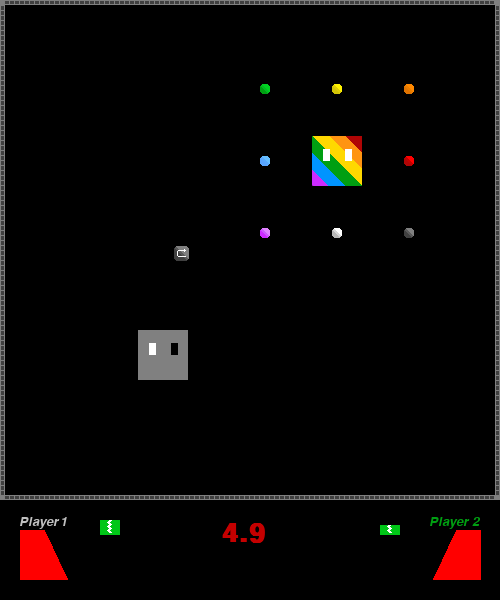

------

A game I created with Python/Pygame for my 8th grade Gifted Class, one of the first programming projects Ive ever done.

Its a general fighting game, with different colored square "Characters", abilities, and basic difficulty settings.

